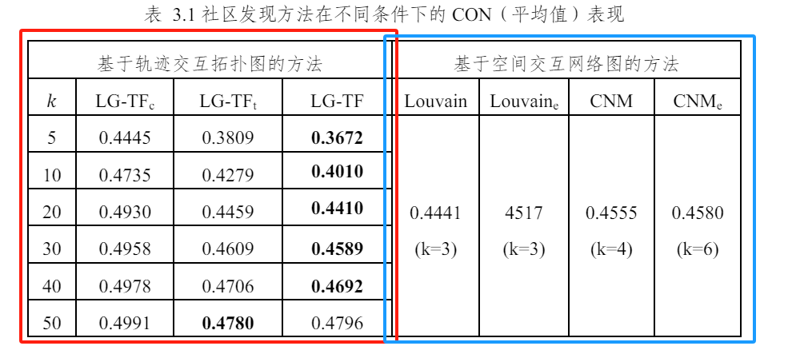
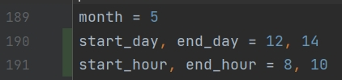
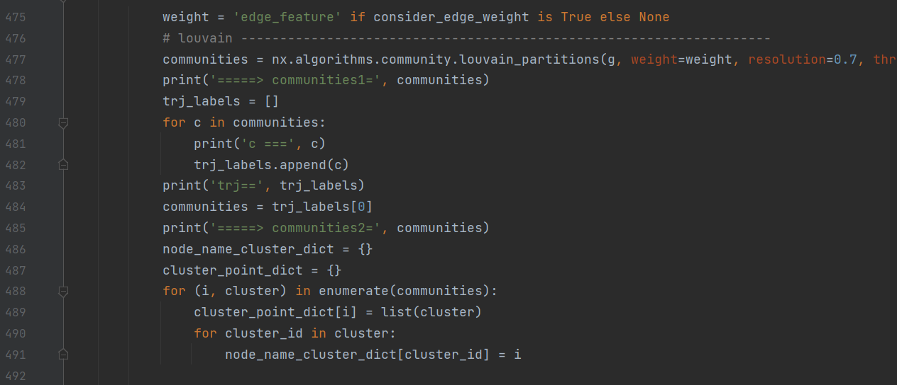
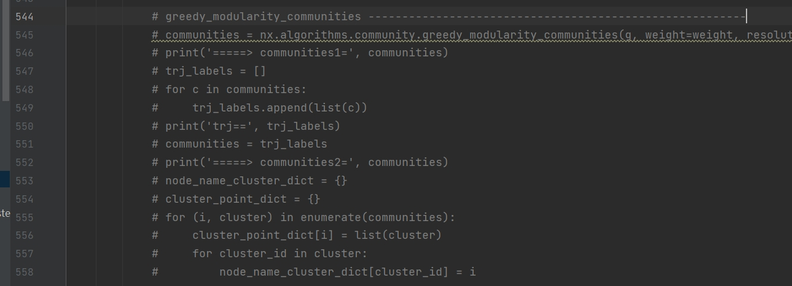

# 运行方式与模块解释
- 该项目可作为社区发现可视分析系统的后端，或执行实验的工具
- 该项目需要使用 GPU
- 可用代码在项目的 `exp` 分支
- 另一个构造OD图和轨迹数据并执行实验的项目`make_od_data`中，逻辑和本项目基本重合，代码基本相似，运行方法仅存在一些差异，具体细节可在`make_od_data`项目中的 README 中找到。

## 1. 实验
### 1.1 大论文第三章中的实验（等同于小论文实验）
如下图，在论文第三章表3.1中，可将第三章实验可分为红色与蓝色两部分，



[//]: # ()
其中，红色框内的实验代码为 `exp3.py`，对应线图的方法；蓝色框内的实验代码为 `exp5.py`，对应传统方法。

#### 1.1.1 数据输入

在 exp3/5.py 中，找到如下变量：


配置日期与时间的范围，即可选择相应时间段内的轨迹数据集作为输入。

#### 1.1.2 参数配置

- 红色框方法（exp3.py）： 
  - `LG-TFc` 是忽略了图的拓扑结构的方法，在代码中的`get_line_graph`函数中，对应变量`is_none_graph_baseline`
  - `LG-TFt` 是忽略了节点属性（轨迹特征）的方法，在在代码中的`get_line_graph`函数中，对应变量`is_none_feat_baseline`
  - `LG-TF` 是本文提出的方法。

  即，若要执行 `LG-TFc`，则配置变量为：
  ```
  is_none_graph_baseline = True
  is_none_feat_baseline = False
  ```
  若要执行 `LG-TFt`，则配置变量为：
  ```
  is_none_graph_baseline = False
  is_none_feat_baseline = True
  ```
  若要执行 `LG-TF`，则配置变量为：
  ```
  is_none_graph_baseline = False
  is_none_feat_baseline = False
  ```
    - 线图方法的实验需要指定社区划分的个数，并且实验可以执行多次取以记录每次划分的结果，配置方法：找到`get_line_graph`函数中的如下片段：
  ```
  for cluster_num in [5, 5, 5, 5, 5]:  # 执行5次线图方法，每次划分的社区个数都是5
    code......
  ```
  该 for 循环的每次执行都会运行一次线图方法，指定的社区划分个数为 `cluster_num`，若要修改执行次数和社区个数，在这行代码中修改数组即可。
- 蓝色框方法（exp5.py）：
  - 该实验部分均运行非线图的传统方法，配置项可在当前文件中找到：
  ```
  consider_edge_weight = True
  use_line_graph = False
  use_igraph = False
  ```
  其中，`use_line_graph` 始终置 `False`。
`Louvain_e` 和 `CNM_e` 方法为考虑边权值的方法，若执行 `Louvain_e` 或 `CNM_e` 方法，则需要将`consider_edge_weight`置为`True`，否则置为`False`。

  -  `Louvain` 方法对应`get_line_graph`函数中的如下代码段：
    
  - `CNM` 方法对应`get_line_graph`函数中的如下代码段：
  
  
    即包含 `nx.algorithms.community.greedy_modularity_communities` 方法的代码段
  - **执行对应传统方法时，需要将该方法的注释打开，并注释另一个方法的代码**

#### 1.1.3 实验结果输出

  - exp3.py（实验结果以 txt 文件存在项目根目录下）：
    - LG-TFc：`exp3_log_none_graph_baseline_Q.txt`
    - LG-TFt：`exp3_log_none_feat_baseline_Q.txt`
    - LG-TF：`exp3_log_our_Q.txt`
  - exp5.py（输出至控制台）：
    - 控制台中存在 "CON = xxxx" 字样的一行，CON 后方的数字即为实验指标

## 2. 代码结构
### 2.1 空间网格划分
网格划分工具：`backend/data_process/SpatialRegionTools.py`，包含
- SpatialRegion 类：研究区域的选择和网格划分参数确定，实际在`get_region()`函数中实例化，该函数中划定了800m*800m的研究区域，这里不用改任何参数。`get_region()`函数在实验代码的主函数开头被调用。
- 一些空间网格坐标和GPS坐标互相转换的方法、判断坐标是否在网格内的方法等

### 2.2 轨迹特征提取
在实验代码的 `get_line_graph()` 函数中，有使用到轨迹特征提取的逻辑，可找到一行代码：
```
trj_feats = run_model2(args, gps_trips, best_model, trj_region)
```
此处的`run_model2()`函数是使用`t2vec`进行轨迹特征提取的方法。这个函数中，输入为轨迹数据`gps_trips`、训练好的模型，和针对轨迹进行的空间网格划分`trj_region`（该空间网格划分对象也由 SpatialRegionTools 类实例化而来，但相关代码在黄家慧项目中，这里是直接从以前生成的文件中读取了）。

### 2.3 线图的构建
线图的构建需要以传统的空间交互网络为输入。在实验代码中，通过调用`get_grid_split()`函数得到传统空间交互网络的邻接表。实验代码中的`get_line_graph()`函数
负责了若干各步骤：线图转换、轨迹特征提取、社区发现
- 线图转换：`get_line_graph_by_selected_cluster()`函数返回的 `lg` 变量是转换后的线图对象。
- 轨迹特征提取：`run_model2()`函数返回的轨迹特征数组
- 社区发现：找到一行代码：`trj_labels = run(adj_mat, features, cluster_num)`，其中`run()`函数即是社区发现方法，入参为邻接矩阵、轨迹特征、社区划分个数。返回的`trj_labels`是一个整数数组，表示社区划分结果，`trj_labels`的数组索引对应入参中轨迹特征数组 `features` 的索引顺序，数组元素是社区 id。

### 2.4 社区发现
社区发现相关代码位于 `backend/gcc/graph_convolutional_clustering/gcc/run.py` 中，该算法的相关细节和论文原文在`backend/gcc/graph_convolutional_clustering/README.md`可找到。

### 2.5 OD 预测


## 3. 数据结构和数据源
该部分内容在 `./轨迹数据源重构.md` 部分